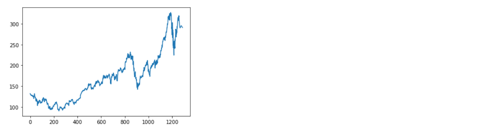

# Stock-Price-Prediction-And-Forecasting-Using-Stacked-LSTM
Stock-Market-Forecasting using DEEP LEARNING

The dataset is taken from AAPL company which I randomly found on the internet. In this model I used the Stacked LSTM(Long Short Term Memory).
A Machine Learning Model for Stock Market Prediction. Stock market prediction is the act of trying to determine the future value of a company stock or other financial instrument traded on a financial exchange.

The API Key can be generated from : https://www.tiingo.com/

The output can be visualized as follows: 

Amazing Tutorial Reference from Krish Naik: https://www.youtube.com/watch?v=H6du_pfuznE

### Note
This project and all of its content are strictly for educational purposes and not a financial advice, and it is not advised to put your money based on its predictions.

